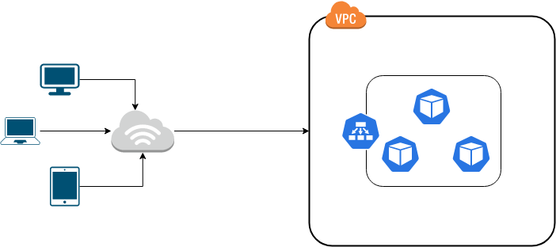

# Arquitetura
A aplicação é executada em cluster de Kubernetes na AWS na frente da aplicação fica um network load balancer para realizar o balanceamento de carga entre os pods.



# Criando usuário Kops na AWS
O usuário do Kops precisa de algumas permissões para que ele possa realizar suasconfigurações:
- AmazonEC2FullAccess
- AmazonRoute53FullAccess
- AmazonS3FullAccess
- IAMFullAccess
- AmazonVPCFullAccess

```
$ aws iam create-group --group-name kops

$ aws iam attach-group-policy --policy-arn arn:aws:iam::aws:policy/AmazonEC2FullAccess --group-name kops

$ aws iam attach-group-policy --policy-arn arn:aws:iam::aws:policy/AmazonRoute53FullAccess --group-name kops

$ aws iam attach-group-policy --policy-arn arn:aws:iam::aws:policy/AmazonS3FullAccess --group-name kops

$ aws iam attach-group-policy --policy-arn arn:aws:iam::aws:policy/IAMFullAccess --group-name kops

$ aws iam attach-group-policy --policy-arn arn:aws:iam::aws:policy/AmazonVPCFullAccess --group-name kops

$ aws iam create-user --user-name kops

$ aws iam add-user-to-group --user-name kops --group-name kops

$ aws iam create-access-key --user-name kops
```

Ao criar o usuário, vamos gerar e salvar sua secret key e a access key.

# Bucket de stado do terraform
O Kops executa toda as suas tarefas de deploy usando o terraform, para que ele possa saber o que esta configurado é necessário que ele salve o estado da execução.

Temos algumas opções para isso, nesse exemplo vamos usar um bucket no S3.

```
$ aws s3api create-bucket \
    --bucket <BUCKET_NAME> \
    --region us-east-1
```

# Habilitando o versionamento do bucket
```
$ aws s3api put-bucket-versioning \
      --bucket <BUCKET_NAME> \
      --versioning-configuration Status=Enabled
```

# Criando o Cluster
1 - Antes de criarmos o cluster vamos exportar algumas variáveis de ambiente, são elas:

```
$ export AWS_ACCESS_KEY_ID= <ACCESS_KEY_USER_KOPS>

$ export AWS_SECRET_ACCESS_KEY=<SECRET_KEY_USER_COPS>

$ export NAME=kops.k8s.local

$ export ZONE=us-east-1a

$ export KOPS_STATE_STORE=s3://prefix-example-com-state-store
```

Agora que exportamos as vairvaiveis vamos criar o plano de execução do cluster:

```
$ kops create cluster --zones $ZONE --name $NAME --networking weave --node-size=t2.micro --master-size=t2.micro --node-count=3
```

2 - Gerando chave ssh para acesso as instâncias do cluster:
```
$ ssh-keygen -b 4096 -t rsa
```

3 -  Listando as chaves existentes:
```
$ kops get secret admin --name $NAME
```

4 - Removendo a chave existente:
```
$ kops delete secret sshpublickey admin --name $NAME <ID_DA_CHAVE>
```

5 - Associando a chave (passo 2) ao cluster:
```
$ kops create secret --name $NAME sshpublickey admin -i ~/.ssh/kops.pub
```

6 - Realizando o Deploy do cluster:
```
$ kops update cluster ${NAME} --network weave --yes
```

7 - Validando a instalação do cluster:
```
$ kops validate cluster ${NAME} --wait 10m
```
8 - Removendo o cluster
```
$ kops delete cluster ${NAME} --yes
```

# Roadmap de Melhorias
1 - Realizar deploy de um API Gateway, criar um endpoint amigável no mesmo e direcionar todo o tráfego da API por ele.

2 - Refatorar o Cluster configurando-o como privado.

3 - Configurar um chartmuseum para armazenar os charts do helm.

4 - Criar um chart no helm para deploys dos recursos da aplicação.

5 - Configurar pipeline CI/CI (Jenkins, Github Actions, Azure Deveps)

6 - Incluiir testes da aplicação (testes unitários, testes funcionais, testes de regressão)